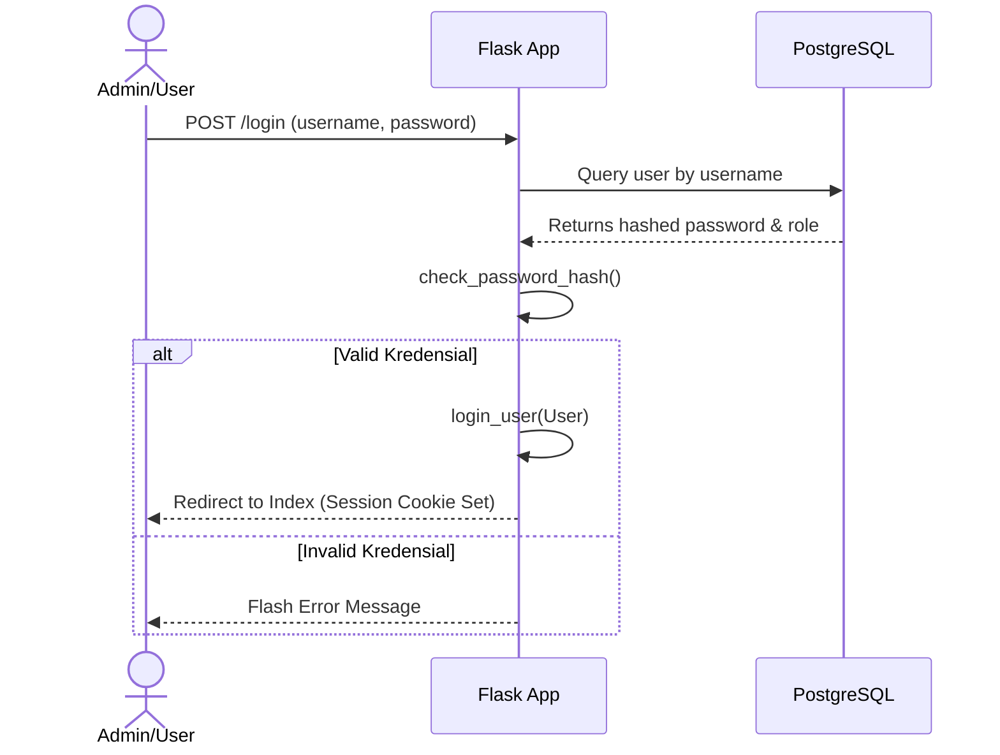
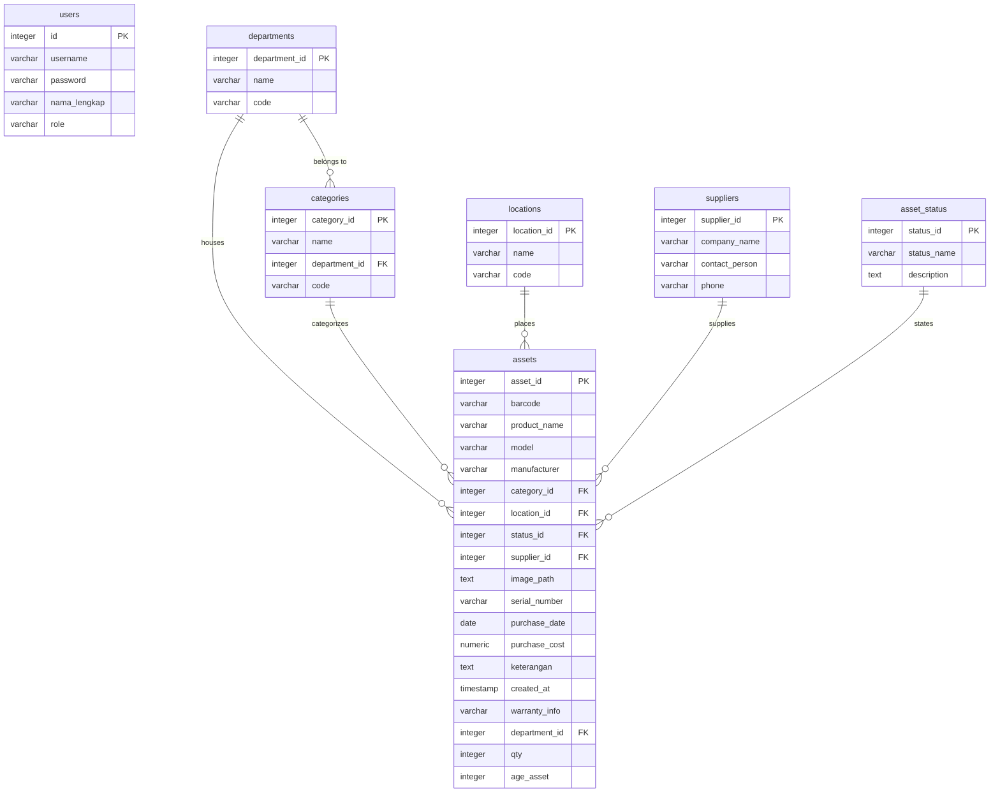

# PROJECT IDENTITY

The **IT Asset Management - Griya Persada Hotel & Resort** is an internal web application designed to track, manage, and audit the lifecycle of IT assets across the hotel premises. It is built as a lightweight, performant Flask web service backed by a PostgreSQL database. The system replaces spreadsheet-based tracking with a single source of truth for assets, their financial depreciation, maintenance status, and quick scan tagging.

This project specifically solves inventory fragmentation and manual barcode generation. It automates the generation of standardized asset barcodes based on category, location, and purchase date codes. By implementing a client-side dynamic QR labeling system, it enables staff to print tags (single or bulk) directly from the browser and scan them using any mobile camera to fetch real-time asset specifications, warranty status, and supplier contacts.

The application adheres to a clean, modular Model-View-Controller (MVC) architecture, albeit lightweight and without a heavy ORM. It interacts with the PostgreSQL database directly via parameterized raw SQL queries using a custom `SimpleConnectionPool` wrapper. The front-end leverages vanilla HTML, CSS (featuring modern system fonts and theme variables), and JavaScript, ensuring instant responsiveness without the overhead of modern Javascript frameworks.

Coding conventions emphasize absolute parameter safety (strictly avoiding SQL injections via psycopg2 query binding), clean error handling with transactional rollbacks, and explicit middleware validation. The master data schema maintains strict foreign key constraints, which triggers automated cascading barcode updates across all dependent asset records when category, department, or location codes change.

---

# MENTAL MODEL

The application functions as a classic server-rendered web application with dynamic client-side enhancements. A developer or AI should think of this codebase as a collection of blueprint-registered handlers operating over a shared connection pool.

Key design principles of this mental model:
- **No ORM Overhead**: All database transactions are executed using raw SQL through a Python context manager (`get_db()`) which borrows and returns connections to a global connection pool.
- **Cascading Identity**: Barcodes are deterministic semantic strings. If a location, category, or department's master code changes, the system cascades this change to rewrite all affected barcodes in the database automatically.
- **Role-based Capabilities**: Operations are divided into Guest (unauthenticated scanner), User (staff with add/edit rights), and Admin (full system access, deletions, and user management).
- **Reverse Proxy Subpath Awareness**: The app does not assume it runs on the root domain. It uses custom WSGI middleware (`ReverseProxied`) to rewrite environment paths, ensuring routing compatibility when deployed under `/inventory` via Nginx.

---

# ARCHITECTURE GRAPH

```mermaid
graph TD
    %% Startup Phase
    subgraph Startup [Application Startup]
        A[wsgi.py / app.py] --> B[create_app]
        B --> C[init_pool - psycopg2 SimpleConnectionPool]
        B --> D[Register Blueprints: auth, assets, settings, api, scanner]
        B --> E[Wrap WSGI with ReverseProxied /inventory]
    end

    %% Request Lifecycle & Middleware
    subgraph Request_Lifecycle [Request Lifecycle]
        F[Client HTTP Request] --> G{ReverseProxied Middleware}
        G -->|Strips /inventory| H[Flask Routing]
        H --> I{@login_required}
        I -->|No| J[Redirect to Login]
        I -->|Yes| K{Auth Role Checks}
        K -->|@admin_required| L[Admin-only Handler]
        K -->|@admin_or_user_required| M[Staff Handler]
        K -->|Public| N[Scanner Handler]
    end

    %% Data Flow & Transaction
    subgraph DB_Flow [Database & Data Access]
        L & M & N --> O[get_db Context Manager]
        O -->|Yields| P[psycopg2 Connection]
        P --> Q[Execute Raw SQL]
        Q -->|Commit| R[Release Conn to Pool]
        Q -->|Rollback on Error| R
    end
```

### Authentication Flow


---

# DOMAIN GRAPH



---

# MODULE GRAPH

### 1. Database Module (`Web/database/`)
- **Purpose**: Low-level database initialization and transaction handling.
- **Responsibilities**:
  - `pool.py`: Manages the psycopg2 connection pool life-cycle, ensuring min/max connection boundaries.
  - `db.py`: Implements a context manager `get_db()` that safely obtains a connection and returns it in a `finally` block.
- **Dependencies**: `psycopg2`, `config.py`
- **Consumers**: All Route Blueprints, User Models.

### 2. Routes Blueprint Module (`Web/routes/`)
- **Purpose**: Handles routing and coordinates business logic.
- **Responsibilities**:
  - `auth.py`: Authentication, user sessions, role decorators, and user management.
  - `assets.py`: Complete CRUD operations for assets, calculations of depreciation, and QR payload rendering.
  - `settings.py`: Direct CRUD operations for reference tables (`locations`, `categories`, `departments`, `suppliers`, `asset_status`).
  - `api.py`: Exposes helper API endpoints for client-side barcode generation, autocomplete feeds, and mass database barcode regeneration.
  - `scanner.py`: Public route (`/scan/<path:barcode>`) accessible by QR codes without authentication to view specific asset details.
- **Dependencies**: `database.db`, `models.user`, `services.helper_service`

### 3. Middleware Module (`Web/middleware/`)
- **Purpose**: Adapts the WSGI environment variables to support reverse proxies.
- **Responsibilities**:
  - `reverse_proxy.py`: Modifies `SCRIPT_NAME` and `PATH_INFO` headers before request reaches Flask, adjusting routing anchors to match the Nginx `/inventory` path.
- **Consumers**: Flask Application object in `app.py`.

### 4. Models Module (`Web/models/`)
- **Purpose**: Defines structured domain representations.
- **Responsibilities**:
  - `user.py`: Implements the `User` class conforming to the `Flask-Login` interface (`UserMixin`) and database loading bindings.
- **Dependencies**: `database.db`

---

# EXECUTION PATHS

### 1. Asset Creation & Barcode Logic
```
Staff Fills Form
  ↓
Submit Form POST /tambah-data
  ↓
Check Qty Input
  ├── If Qty > 1: Loop and append sequential suffix (e.g., "-001", "-002") to Base Barcode
  └── If Qty = 1: Use unmodified Barcode
  ↓
Run INSERT INTO assets SQL
  ↓
Commit Transaction & Return to Pool
```

### 2. Cascading Barcode Rewrite on Settings Update
```
Admin updates code for a location (e.g., LOC-A to LOC-B)
  ↓
POST /settings/locations/save
  ↓
Update locations table code
  ↓
Retrieve all assets matching location_id
  ↓
Loop through assets and replace old location code in barcode string (split & join /)
  ↓
Update assets table with new barcode values
  ↓
Commit and redirect
```

### 3. Anonymous QR Scanning Workflow
```
Scan QR Code from Asset Tag
  ↓
Browser opens /scan/<barcode> (No Login Required)
  ↓
Fetch asset data joining category, supplier, status, department, and location names
  ↓
If supplier has phone, convert format (e.g., starting with 0 to international '62')
  ↓
Generate WhatsApp direct communication link
  ↓
Render public scan.html template
```

---

# DEPENDENCY CHAINS

### Asset Operations Chain
```
assets.py (Route blueprint)
  ↓
get_db (Context manager borrowing psycopg2 connection)
  ↓
SimpleConnectionPool (Manages concurrent connections to PostgreSQL)
  ↓
PostgreSQL DB
```

### Authentication Chain
```
auth.py (Route blueprint / admin decorators)
  ↓
User Class (models/user.py)
  ↓
get_db (database/db.py)
  ↓
PostgreSQL DB
```

---

# IMPORT HOTSPOTS

- **`database.db.get_db`**: Used in almost every database-touching function in `routes/` and `models/`. It is the central adapter for SQL query execution.
- **`services.helper_service.rows_to_dict`**: Utilized in all analytical and retrieval routes to map list results from psycopg2 cursors to structured dictionary keys, aligning them with templates.
- **`routes.auth.admin_required` & `admin_or_user_required`**: Decorators scattered across write-heavy routes to enforce strict authorization controls.

---

# KNOWLEDGE GRAPH

```text
IT Asset Management Project
├── Web/ (Core Application)
│   ├── app.py (Entry point & extension register)
│   ├── config.py (Environment parameter mapping)
│   ├── database/ (Database interface)
│   │   ├── db.py (Context wrapper)
│   │   └── pool.py (psycopg2 resource manager)
│   ├── middleware/ (WSGI adaptation layer)
│   │   └── reverse_proxy.py (Subpath mapping)
│   ├── models/ (Entity representation)
│   │   └── user.py (Auth model mapping)
│   ├── routes/ (Routing controller blueprints)
│   │   ├── auth.py (Session controller & user administration)
│   │   ├── assets.py (Inventory controller & depreciation engine)
│   │   ├── settings.py (Metadata / lookup table controller)
│   │   ├── api.py (Helpers & regeneration utilities)
│   │   └── scanner.py (Unauthenticated mobile detail reader)
│   ├── static/ (Client-side assets)
│   │   ├── erd.xml & alur_program.xml (Draw.io blueprints)
│   │   ├── *.css (Modular UI layout formatting)
│   │   └── *.js (Client-side interactive engines)
│   └── templates/ (Jinja2 interface skins)
└── Deployment Scripts
    └── run.sh (Automated Gunicorn daemon launcher)
```

---

# AI NAVIGATION

### Resolving Authentication/Authorization Bugs
- Locate [auth.py](file:///g:/Project_magang/Project-GP-Inventory-IT-Asset/Web/routes/auth.py) for session endpoints and security decorators.
- Locate [user.py](file:///g:/Project_magang/Project-GP-Inventory-IT-Asset/Web/models/user.py) to edit user payload mapping or DB loaders.

### Changing Barcode Formats or Generation Logic
- Locate [api.py](file:///g:/Project_magang/Project-GP-Inventory-IT-Asset/Web/routes/api.py#L21) for the main mass/single barcode construction code.
- Locate [assets.py](file:///g:/Project_magang/Project-GP-Inventory-IT-Asset/Web/routes/assets.py#L185) for the creation-time barcode calculation.
- Review [tambah-data.js](file:///g:/Project_magang/Project-GP-Inventory-IT-Asset/Web/static/tambah-data.js) for corresponding front-end calculation.

### Modifying Inventory Fields/Calculation
- Update the database schema via [backup_inventory_db.sql](file:///g:/Project_magang/Project-GP-Inventory-IT-Asset/backup_inventory_db.sql).
- Locate [assets.py](file:///g:/Project_magang/Project-GP-Inventory-IT-Asset/Web/routes/assets.py) to modify insert tuples, updates, and depreciation logic.

---

# PROJECT RULES

1. **Explicit Transaction Handling**: Database transactions must be committed explicitly using `conn.commit()` after write/update operations and rolled back using `conn.rollback()` inside `except` statements.
2. **Prevent Injection**: Do not string-format or concatenate parameters directly in SQL queries. Always use `%s` query bindings provided by psycopg2.
3. **No Direct DB Connection Spawning**: Never construct ad-hoc connections outside `get_db()`.
4. **Proxy Compatibility**: All routes generating dynamic redirect URLs or templates must use Flask's routing utilities (`url_for`) to ensure the WSGI script name adjustment (`/inventory`) is automatically injected.
5. **No Database Operations in Templates**: Perform all calculations (e.g. depreciation, barcode generation) inside the Python layer and supply raw results to the Jinja layout.

---

# TOKEN OPTIMIZATION

### High-Priority Files (Always Load)
- [app.py](file:///g:/Project_magang/Project-GP-Inventory-IT-Asset/Web/app.py) (Initialization context)
- [db.py](file:///g:/Project_magang/Project-GP-Inventory-IT-Asset/Web/database/db.py) (Database entry point)
- [pool.py](file:///g:/Project_magang/Project-GP-Inventory-IT-Asset/Web/database/pool.py) (Connection constraints)
- [assets.py](file:///g:/Project_magang/Project-GP-Inventory-IT-Asset/Web/routes/assets.py) (Core logic implementation)

### Low-Priority Files (Rarely Needed)
- [reverse_proxy.py](file:///g:/Project_magang/Project-GP-Inventory-IT-Asset/Web/middleware/reverse_proxy.py)
- [helper_service.py](file:///g:/Project_magang/Project-GP-Inventory-IT-Asset/Web/services/helper_service.py)
- [resetpw.py](file:///g:/Project_magang/Project-GP-Inventory-IT-Asset/Web/resetpw.py)

### Large Assets & Folders to Ignore
- `__pycache__/` directories
- `.git/` directories
- `.xml` diagram assets in `Web/static/`

---

# AI MEMORY

### Core Purpose & Tech Stack
The IT Asset Management system for Griya Persada Hotel & Resort is a lightweight, responsive Flask web application running on Python 3 and backed by PostgreSQL. It does not use ORMs or high-overhead JS frameworks, opting instead for parameterized raw SQL transactions via `psycopg2` and server-rendered templates using Jinja2, Vanilla JS, and custom Vanilla CSS.

### Database Design & Pooling
The application communicates with PostgreSQL via a centralized database connection pool initialized in [pool.py](file:///g:/Project_magang/Project-GP-Inventory-IT-Asset/Web/database/pool.py) and retrieved via the `get_db()` context manager in [db.py](file:///g:/Project_magang/Project-GP-Inventory-IT-Asset/Web/database/db.py). The database contains seven core tables:
- `users`: Stores account information, credentials hashed via `werkzeug.security`, and access roles (`user`, `admin`).
- `assets`: Represents physical assets, tracking identifiers (barcode, serial number), metadata, purchase parameters, and depreciation variables.
- `departments`, `categories`, `locations`, `suppliers`, `asset_status`: Maintain master structural metadata.

### Barcode Generation & Cascading Updates
A core feature is the standardized, deterministic barcode schema:
`MAINGROUP/SUBGROUP-INISIAL_MODEL/LOKASI/TANGGAL_BELI/KODE_HOTEL-001`
When an administrator edits the code of a Department, Category, or Location, the system intercepts the update in [settings.py](file:///g:/Project_magang/Project-GP-Inventory-IT-Asset/Web/routes/settings.py) and executes an automatic cascading rewrite on all related assets. It parses their barcodes, updates the matching code segment, and saves the new barcodes back to the database.

### Depreciation & Lifecycle
Asset financial depreciation is calculated on-the-fly inside the `/lihat-tabel` route. It computes months elapsed since the `purchase_date` relative to the current calendar date and divides `purchase_cost` by the asset's useful life in months (`age_asset`). It subtracts this accumulated depreciation from the purchase cost to yield a current valuation floor-capped at 0.

### Reverse Proxy Configuration
To run seamlessly under Nginx reverse proxy subpaths (specifically `/inventory`), [reverse_proxy.py](file:///g:/Project_magang/Project-GP-Inventory-IT-Asset/Web/middleware/reverse_proxy.py) acts as a custom WSGI wrapper that adjusts the request's `SCRIPT_NAME` and `PATH_INFO` headers. This prevents routing degradation when dynamic redirect functions inside Flask are fired.
