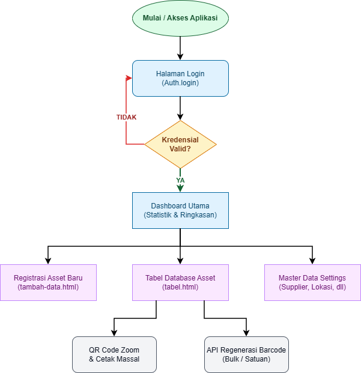
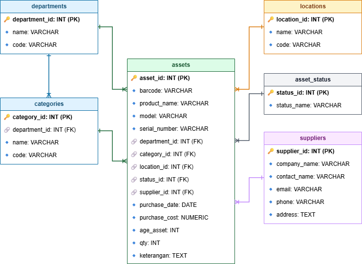

# 🏢 IT Asset Management - Griya Persada Hotel & Resort

[](https://www.python.org/)
[](https://flask.palletsprojects.com/)
[](https://www.postgresql.org/)

Aplikasi web internal untuk mencatat, melacak, dan mengelola siklus hidup aset inventaris IT di lingkungan Griya Persada Hotel & Resort.

---

## 🚀 Fitur Utama

*   🖥️ **Desain UI Apple Style**: Antarmuka bersih, minimalis, dan responsif (nyaman diakses lewat desktop maupun HP).
*   🌓 **Symmetric Dark/Light Mode**: Tema gelap/terang terintegrasi yang tersimpan otomatis di `localStorage` peramban.
*   🏷️ **Generator Tag ID Otomatis**: Membuat format barcode aset secara seragam: `MAINGROUP/SUBGROUP-INISIAL_MODEL/LOKASI/TANGGAL_BELI/KODE_HOTEL-001` (contoh: `IT/LAP-T14/SRV/2026-05/GPB-001`).
*   📉 **Kalkulasi Penyusutan (Depresiasi)**: Perhitungan nilai sisa aset secara real-time berdasarkan bulan berjalan dan estimasi umur manfaat barang.
*   🖨️ **Sistem Labeling & QR Code**: 
    - Menghasilkan QR Code dinamis untuk tiap aset secara instan via `QRCode.js`.
    - Zoom QR Code dan cetak satuan.
    - **Cetak Massal**: Memungkinkan pencetakan banyak label sekaligus berdasarkan pilihan baris tabel.
*   🔄 **Regenerasi Barcode Database**: API internal untuk memperbarui format barcode seluruh aset di database secara massal jika terjadi pembaruan kode kategori/lokasi.

---

## 🛠️ Tech Stack & Dependencies

*   **Backend**: Python (Flask Framework)
*   **Database**: PostgreSQL dengan psycopg2 connection pooling
*   **Frontend**: Jinja2 Templates, Vanilla CSS (CSS Variables), Vanilla JavaScript
*   **Autentikasi**: Flask-Login untuk pengelolaan sesi admin, enkripsi password menggunakan Werkzeug.

---

## 📁 Struktur Direktori

```text
├── Web/
│   ├── database/          # Modul koneksi PostgreSQL & Pool management
│   │   ├── pool.py        # Pengatur pool koneksi PostgreSQL
│   │   └── db.py          # Context manager untuk meminjam/melepas koneksi
│   ├── middleware/        # Middleware WSGI (Reverse Proxy helper)
│   │   └── reverse_proxy.py
│   ├── models/            # Struktur representasi data (User)
│   │   └── user.py
│   ├── routes/            # Rute URL dan logika bisnis aplikasi
│   │   ├── auth.py        # Autentikasi Admin & Manajemen Pengguna
│   │   ├── assets.py      # CRUD Aset, Depresiasi, dan Cetak QR Code
│   │   ├── settings.py    # Master Data (Departemen, Lokasi, Kategori, Supplier)
│   │   ├── api.py         # Endpoint API pendukung (Autocomplete & Barcode Generator)
│   │   └── scanner.py     # Modul pembaca barcode aset
│   ├── services/          # Kelas helper (Custom JSON encoder)
│   │   └── helper_service.py
│   ├── static/            # Berkas statis pendukung frontend
│   │   ├── alur_program.xml # Diagram Alur Program (Draw.io compatible)
│   │   ├── erd.xml        # Diagram ERD Database (Draw.io compatible)
│   │   ├── *.css          # Berkas CSS (index, tabel, tambah-data, login)
│   │   └── *.js           # Interaksi JS frontend
│   ├── templates/         # Berkas HTML template Jinja2
│   ├── config.py          # Konfigurasi aplikasi Flask
│   ├── requirements.txt   # Dependensi modul python
│   ├── wsgi.py            # Entrypoint WSGI Server (Gunicorn)
│   ├── app.py             # Inisialisasi awal server Flask
│   └── .env               # File konfigurasi lokal (Database & Secret Key)
├── backup_inventory_db.sql # Backup skema & data awal database (format SQL)
├── inventory_db.dump      # Backup database (format binary dump)
├── README.md              # Dokumentasi ini
└── run.sh                 # Script deployment otomatis di Linux (Nginx/Gunicorn)
```

---

## 📊 Visualisasi & Dokumentasi Arsitektur

#### 🔄 Alur Kerja Sistem (Workflow)


#### 🗄️ Database Schema (ERD)


Kami menyediakan diagram interaktif yang dapat Anda impor langsung ke **[draw.io](https://app.diagrams.net)** untuk memudahkan analisis sistem:

*   **ERD Database (`Web/static/erd.xml`)**: Diagram relasional 6 tabel database (`assets`, `departments`, `categories`, `locations`, `asset_status`, `suppliers`) dengan tipe data, *Primary Key* (PK), *Foreign Key* (FK), dan garis relasi.
*   **Alur Program (`Web/static/alur_program.xml`)**: Flowchart visual yang mendokumentasikan alur data aplikasi dari autentikasi hingga pengelolaan aset dan pencetakan QR Code.

> **Cara Membaca Diagram**: Buka draw.io -> Klik **File > Import From > Device...** -> Pilih salah satu file XML di atas.

---

## ⚙️ Panduan Instalasi & Konfigurasi

Ikuti langkah-langkah berikut untuk menjalankan aplikasi di lingkungan lokal Anda:

### 1. Prasyarat Sistem
*   Python versi 3.8 atau yang lebih baru.
*   Server PostgreSQL yang aktif.

### 2. Persiapan Virtual Environment
Jalankan perintah berikut di terminal/CMD:
```bash
# Masuk ke folder proyek
cd "3. Project-IT-Asset"

# Membuat Virtual Environment (venv)
python -m venv venv

# Mengaktifkan venv (Windows)
venv\Scripts\activate

# Mengaktifkan venv (macOS/Linux)
source venv/bin/activate
```

### 3. Install Library Dependensi
```bash
pip install -r Web/requirements.txt
```

### 4. Setup Database PostgreSQL
1. Buat database baru di PostgreSQL Anda (contoh nama database: `inventory_db`).
2. Buat user admin PostgreSQL (contoh user: `inventory_admin` dengan password `GPBandungan2025`).
3. Impor data menggunakan salah satu berkas backup yang tersedia:

**Melalui file `.sql` (Rekomendasi):**
```bash
psql -U inventory_admin -d inventory_db -f backup_inventory_db.sql
```

**Melalui file `.dump` (Alternatif):**
```bash
pg_restore -U inventory_admin -d inventory_db -v inventory_db.dump
```

### 5. Buat File Konfigurasi Lokal (`.env`)
Buat file baru bernama `.env` di dalam folder `Web/` (`Web/.env`) dan isi dengan kredensial database Anda:
```env
SECRET_KEY=gp-bandungan-secret-key-123-production-change-me
DB_HOST=127.0.0.1
DB_PORT=5432
DB_NAME=inventory_db
DB_USER=inventory_admin
DB_PASSWORD=GPBandungan2025
DB_POOL_MINCONN=1
DB_POOL_MAXCONN=20
```

### 6. Menjalankan Aplikasi
**Mode Pengembangan (Development):**
```bash
python Web/app.py
```
Aplikasi akan aktif secara lokal di `http://127.0.0.1:5000`.

**Mode Produksi (Linux dengan Gunicorn):**
```bash
chmod +x run.sh
./run.sh
```

---

## 📝 Lisensi
Dokumen ini dibuat dan dikembangkan sepenuhnya oleh **IT Department - Griya Persada Hotel & Resort**. Hak cipta dilindungi undang-undang.